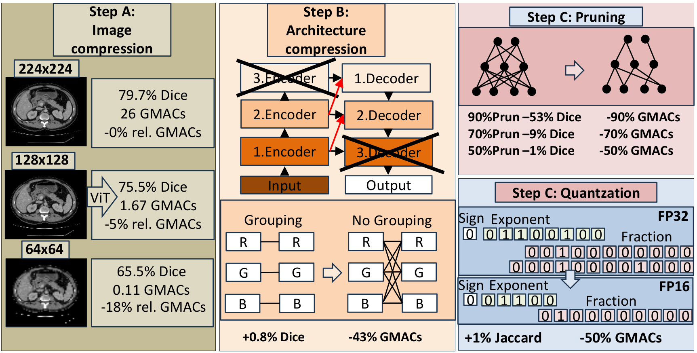
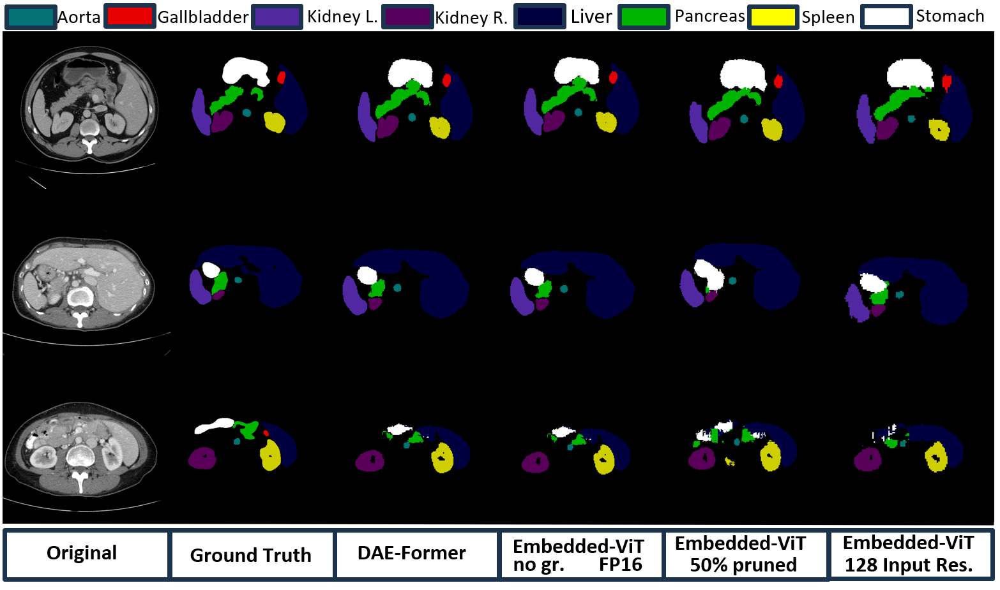

# Embedded-ViT: A Framework for Embedded Deployment of Vision-Transformer in Medical Applications - ISVC 2024

Transformer architectures have dramatically influenced the field of natural language processing and are becoming more popular in the computer vision field, too. However, the Transformer's core self-attention mechanism has quadratic computational complexity concerning the number of tokens. Thus, they usually require big GPUs for deployment, contrary to the Internet of Things trend, which enables the mobile deployment of AI applications, which involves the development of efficient, lightweight neural networks to meet the strict hardware limitations of the target platforms. The cost and ease of deployment are even more critical in the medical field, and not every clinic can afford to buy a lot of powerful GPUs to aid the physicians. Therefore, research proposed some methods to achieve more efficient transformer networks, but to our knowledge, very limited work targeted a level of complexity reduction that allows the embedded deployment of transformers in the medical field. In this paper, we propose our Embedded-ViT framework with which we can drastically reduce the complexity of standard vision transformer (ViT) networks. We accomplish that using several compression techniques: efficient model architecture changes, reduced input resolution, pruning, or quantization. Our optimizations can significantly compress the model, while maintaining a desired prediction quality level. We prove the capabilities of our framework by applying it to a state-of-the-art ViT and its variations. We tested the results of our Embedded-ViT on the publicly available Synapse dataset for multi-organ segmentation. Our framework cuts the computational load by half while maintaining a slightly higher level of prediction quality. 



## How to use

The script train.py contains all the necessary steps for training the network. A list and dataloader for the Synapse dataset are also included.
To load a network, use the --module argument when running the train script (``--module <directory>.<module_name>.<class_name>``, e.g. ``--module networks.Embedded-ViT.EmbeddedViT``)


### Training and Testing

1) Download the Synapse dataset from [here](https://drive.google.com/uc?export=download&id=18I9JHH_i0uuEDg-N6d7bfMdf7Ut6bhBi).

2) Run the following code to install the Requirements.

    `pip install -r requirements.txt`

3.1) Run the below code to train the Embedded-ViT with and without grouping on the synapse dataset with image sizes of 224, 128 or 64.
    
    python3 train.py --root_path ./data/Synapse/train_npz --test_path ./data/Synapse/test_vol_h5 --batch_size 10 --eval_interval 1 --max_epochs 1 --module networks.Embedded-ViT_224.EmbeddedViT --img_size 224
   
    
    
    python3 train.py --root_path ./data/Synapse/train_npz --test_path ./data/Synapse/test_vol_h5 --batch_size 10 --eval_interval 1 --max_epochs 1 --module networks.Embedded-ViT_128.EmbeddedViT --img_size 128
   
    
    
    python3 train.py --root_path ./data/Synapse/train_npz --test_path ./data/Synapse/test_vol_h5 --batch_size 10 --eval_interval 1 --max_epochs 1 --module networks.Embedded-ViT_64.EmbeddedViT --img_size 64
   
    
    `
    python3 train.py --root_path ./data/Synapse/train_npz --test_path ./data/Synapse/test_vol_h5 --batch_size 10 --eval_interval 1 --max_epochs 1 --module networks.Embedded-ViT_224_grouping.EmbeddedViT --img_size 224
   
    
    
    python3 train.py --root_path ./data/Synapse/train_npz --test_path ./data/Synapse/test_vol_h5 --batch_size 10 --eval_interval 1 --max_epochs 1 --module networks.Embedded-ViT_128_grouping.EmbeddedViT --img_size 128
    
    
    
    python3 train.py --root_path ./data/Synapse/train_npz --test_path ./data/Synapse/test_vol_h5 --batch_size 10 --eval_interval 1 --max_epochs 1 --module networks.Embedded-ViT_64_grouping.EmbeddedViT --img_size 64
    

3.2) For half precision training use ``train_half.py`` instead ``train.py``Run the below code to train the Embedded-ViT on the synapse dataset.


    **--root_path**     [Train data path]

    **--test_path**     [Test data path]

    **--eval_interval** [Evaluation epoch]

    **--module**        [Module name, including path (can also train your own models)]
    


3.3) To prun the trained full precision model run the below code
    
    python3 train_prun_224.py --root_path ./data/Synapse/train_npz --test_path ./data/Synapse/test_vol_h5 --batch_size 10 --eval_interval 1 --max_epochs 1 --module networks.Embedded-ViT_224.EmbeddedViT --input_model ./PATH/TO/MODEL/synapse_epoch_399.pth
    
    
    
    python3 train_prun_128.py --root_path ./data/Synapse/train_npz --test_path ./data/Synapse/test_vol_h5 --batch_size 10 --eval_interval 1 --max_epochs 1 --module networks.Embedded-ViT_128.EmbeddedViT --input_model ./PATH/TO/MODEL/synapse_epoch_399.pth
    
    
    
    python3 train_prun_64.py --root_path ./data/Synapse/train_npz --test_path ./data/Synapse/test_vol_h5 --batch_size 10 --eval_interval 1 --max_epochs 1 --module networks.Embedded-ViT_64.EmbeddedViT --input_model ./PATH/TO/MODEL/synapse_epoch_399.pth
    ```
    
    
    python3 train_prun_224.py --root_path ./data/Synapse/train_npz --test_path ./data/Synapse/test_vol_h5 --batch_size 10 --eval_interval 1 --max_epochs 1 --module networks.Embedded-ViT_224_grouping.EmbeddedViT --input_model ./PATH/TO/MODEL/synapse_epoch_399.pth
    
    
    
    python3 train_prun_128.py --root_path ./data/Synapse/train_npz --test_path ./data/Synapse/test_vol_h5 --batch_size 10 --eval_interval 1 --max_epochs 1 --module networks.Embedded-ViT_128_grouping.EmbeddedViT --input_model ./PATH/TO/MODEL/synapse_epoch_399.pth
    
    
   
    python3 train_prun_64.py --root_path ./data/Synapse/train_npz --test_path ./data/Synapse/test_vol_h5 --batch_size 10 --eval_interval 1 --max_epochs 1 --module networks.Embedded-ViT_64_grouping.EmbeddedViT --input_model ./PATH/TO/MODEL/synapse_epoch_399.pth
   
    
 4) Run the below code to test the Embedded-ViT on the synapse dataset in full and half precision.
    ```bash
    python test.py --volume_path ./data/Synapse/ --output_dir './model_out'
    python test_half.py --volume_path ./data/Synapse/ --output_dir './model_out'
    ```
    **--volume_path**   [Root dir of the test data]
        
    **--output_dir**    [Directory of your learned weights]
    
## Results
Qualitative segmentation results on BraTS and DECATHLON



## Acknowledgements

We gratefully thank the authors of [https://github.com/xmindflow/DAEFormer](https://github.com/xmindflow/DAEFormer), from which some parts of our code are inspired.


